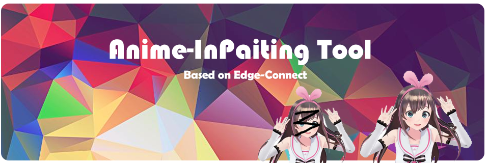
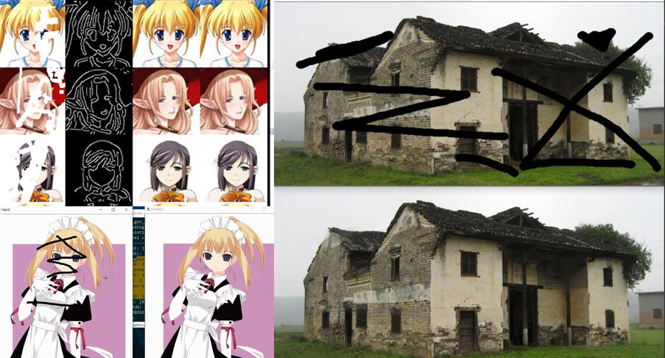
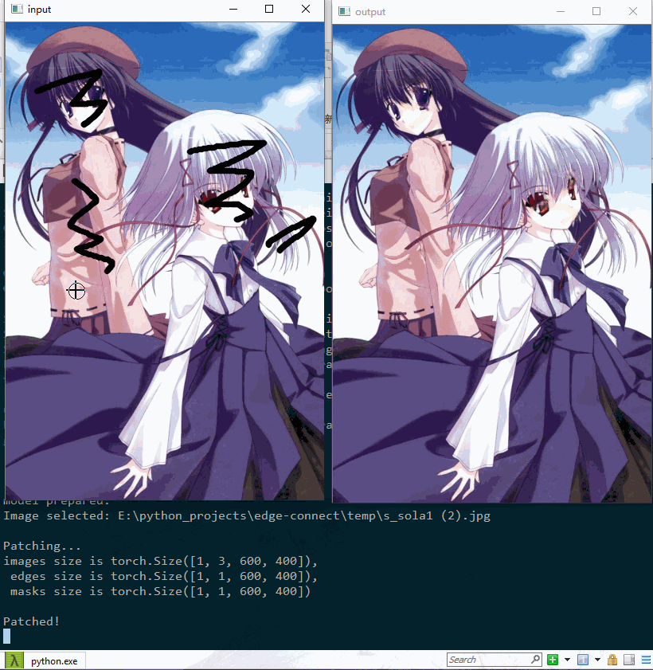
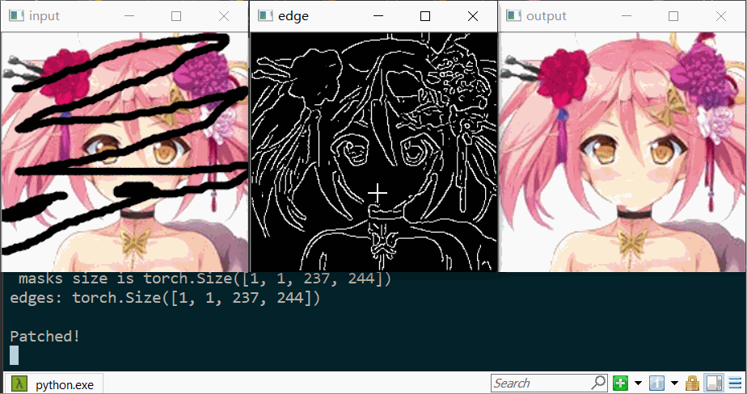

Anime-InPainting: An application Tool based on [Edge-Connect](https://github.com/knazeri/edge-connect)
------------------------------------------------------------------------------------------------------
<p align="left">
		
		
		
		
		
</p>

English | [中文版介绍](#jump_zh)

<hr>

### Important
**2019.3.27 Update:**     
Our **latest** drawing method [PI-REC](https://github.com/youyuge34/PI-REC) is more powerful.      
 Take a look on it, and I'm sure it won't disappoint you.
<hr>

<p align="center">

</p>

## Tool show time 🏳️‍🌈
#### Outputs
<p align="center">

</p>

#### Tool operation
<p align="center">


</p>

Introduction:
-----
This is an optimized application tool which has a frontend based on `Opencv`, whose backend used [Edge-Connect](https://github.com/knazeri/edge-connect).
Make sure you have read their awesome work and license thoroughly.
Compared with the original work, this project has such <span id="improve">improvements</span> :
- Add tool application modes
- Optimize the training phase
  - Auto-save and auto-load latest weights files
  - Add a fast training phase combined with origin phase 2 and 3
- bugs fixed (most of them are merged into the original work)
- Add utility files
- Add configs in `config.yml`
  - PRINT_FREQUENCY
  - DEVICE : cpu or gpu
- ... ...

**You can do the amazing Anime inpainting conveniently here.**

**And detailed [training manual](training_manual.md) is released. You may train your own dataset smoothly now.**

## <span id='pre'>Prerequisites</span>
- Python 3
- PyTorch `1.0` (`0.4` is not supported)
- NVIDIA GPU + CUDA cuDNN

## <span id='ins'>Installation</span>
- Clone this repo
- Install PyTorch and dependencies from http://pytorch.org
- Install python requirements:
```bash
pip install -r requirements.txt
```

## Run the Tool
I want to run the tool! Calm down and follow such step:


**Info: The following weights files are trained on anime face dataset which performs not good on a large whole anime character.**
1. Download the well trained model weights file --> [Google Drive](https://drive.google.com/file/d/12I-K7GQEXEL_rEOVJnRv7ecVHyuZE-1-/view?usp=sharing) | [Baidu](https://pan.baidu.com/s/1WkeRtYViGGGw4fUqPo3nsg)
2. Unzip the `.7z` and put it under your root directory.
So make sure your path now is: `./model/getchu/<xxxxx.pth>`
3. Complete the above [Prerequisites](#pre) and [Installation](#ins)
4. (Optional) Check and edit the `./model/getchu/config.yml` config file as you wish
5. Run the cooool tool:

#### Default Tool:

```bash
python tool_patch.py --path model/getchu/
```

#### Tool with edge window:

```bash
python tool_patch.py --edge --path model/getchu/
```

#### Args help
```bash
python tool_patch.py -h
```

> PS. You can run any well trained model, not only above one. You can download more model weights files
from the original work [Edge-Connect](https://github.com/knazeri/edge-connect). Then you can run the Tool as above.
Only one thing to be careful: The `config.yml` in this project has some additional options than the config from the [Edge-Connect](https://github.com/knazeri/edge-connect).


## Tool operation
For detailed manual, refer to your `terminal` prints or the `__doc__` in `tool_patch.py`.

Below is the simplified tool operation manual:


Key | description
-----|-----
Mouse `Left` | To draw out the defective area in window `input` and to draw the edge in window `edge`
Mouse `Right` | To erase edge in window `edge`
Key `[` | To make the brush thickness smaller
Key `]` | To make the brush thickness larger
Key `0` | Todo
Key `1` | Todo
Key `n` | To patch the black part of image, just use input image
Key `e` | To patch the black part of image, use the input image and edit edge (only work under edge window opened)
Key `r` | To reset the setup
Key `s` | To save the output
Key `q` | To quit

## Training manual
Click here --> [Training manual by yourself](training_manual.md)


<span id="jump_zh">中文版介绍🇨🇳 </span>
-----

<hr>

### 重要
**2019.3.27 更新:**     
我们的最新模型 [PI-REC](https://github.com/youyuge34/PI-REC) 更强大.            
如果你想用最新的AI绘画黑科技，而非仅仅是修补图像，请点击上面的链接👆
<hr>


## 简介
Tool效果看上面👆 | Bilibili视频教程：TO DO

这是图像修补方向最新研究成果[Edge-Connect](https://github.com/knazeri/edge-connect)的~~阿姆斯特朗氮气加速魔改~~（优化）版。
用`Opencv`写了个前端部分，后端是[Edge-Connect](https://github.com/knazeri/edge-connect)，方便当作工具使用。
此工具可以用来自动图像修补，去马赛克……同样优化了模型训练的过程。具体优化内容请看[英文版Improvements](#improve)。

更新：[训练手册](training_manual.md#jump_zh)已经填坑完发布了！你可以照着指南训练自己数据集了~

## 基础环境
- Python 3
- PyTorch `1.0` (`0.4` 会报错)
- NVIDIA GPU + CUDA cuDNN （当前版本已可选cpu，请修改`config.yml`中的`DEVICE`）

## 第三方库安装
- Clone this repo
- 安装PyTorch和torchvision --> http://pytorch.org
- 安装 python requirements:
```bash
pip install -r requirements.txt
```

## 运行Tool
教练！我有个大胆的想法🈲……别急，一步步来：


**注意：以下模型是在动漫头像数据集上训练的，所以对动漫全身大图修补效果一般，想自己再训练的参考下面的训练指南**
1. 下训练好的模型文件 --> [Google Drive](https://drive.google.com/file/d/12I-K7GQEXEL_rEOVJnRv7ecVHyuZE-1-/view?usp=sharing) | [Baidu](https://pan.baidu.com/s/1WkeRtYViGGGw4fUqPo3nsg)
2. 解压 `.7z` 放到你的根目录下.
确保你的目录现在是这样: `./model/getchu/<xxxxx.pth>`
3. 完成上面的基础环境和第三方库安装步骤
4. (可选) 检查并编辑 `./model/getchu/config.yml` 配置文件
5. 使用以下命令运行：

#### 默认Tool:

```bash
python tool_patch.py --path model/getchu/
```

#### 带Edge编辑窗口的Tool:

```bash
python tool_patch.py --edge --path model/getchu/
```

#### 命令行参数帮助
```bash
python tool_patch.py -h
```

> PS. 你也能用tool跑别的任何模型，在这里下载原作更多模型[Edge-Connect](https://github.com/knazeri/edge-connect).
文件组织方式参考上面，其余运行命令都一样。唯一注意的是这个项目的 `config.yml` 比原作的多了几个选项，报错了的话注意修改。

## Tool操作指南
详细内容请翻看控制台的打印内容，或查看`tool_patch.py`里的`__doc__`      
简略版tool使用指南：

按键 | 说明
-----|------
鼠标左键 | Input窗口：画出瑕疵区域的遮盖，Edge窗口：手动画边缘
鼠标右键 | Edge窗口：橡皮擦
按键 `[` | 笔刷变细 （控制台打印粗细大小）
按键 `]` | 笔刷变粗
按键 `0` | Todo
按键 `1` | Todo
按键 `n` | 修补黑色涂抹区域，只使用一张输入图片
按键 `e` | 修补黑色涂抹区域，使用输入图片和边缘图片（仅当edge窗口启动时有效）
按键 `r` | 全部重置
按键 `s` | 保存输出图片
按键 `q` | 退出


## 训练指南
训练指南 --> [阅读](training_manual.md#jump_zh)


## License
Licensed under a [Creative Commons Attribution-NonCommercial 4.0 International](https://creativecommons.org/licenses/by-nc/4.0/).

Except where otherwise noted, this content is published under a [CC BY-NC](https://creativecommons.org/licenses/by-nc/4.0/) license, which means that you can copy, remix, transform and build upon the content as long as you do not use the material for commercial purposes and give appropriate credit and provide a link to the license.


## Citation
If you use this code for your research, please cite our paper <a href="https://arxiv.org/abs/1901.00212">EdgeConnect: Generative Image Inpainting with Adversarial Edge Learning</a>:

```
@inproceedings{nazeri2019edgeconnect,
  title={EdgeConnect: Generative Image Inpainting with Adversarial Edge Learning},
  author={Nazeri, Kamyar and Ng, Eric and Joseph, Tony and Qureshi, Faisal and Ebrahimi, Mehran},
  journal={arXiv preprint},
  year={2019},
}
```

